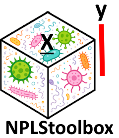

<!-- README.md is generated from README.Rmd. Please edit that file -->

# NPLStoolbox 

<!-- badges: start -->

[](https://github.com/GRvanderPloeg/NPLStoolbox/actions/workflows/R-CMD-check.yaml)
[](https://app.codecov.io/gh/GRvanderPloeg/NPLStoolbox)
<!-- badges: end -->

## Overview

The `NPLStoolbox` allows researchers to use the N-way Partial Least
Squares method for their multi-way data.

- `ncrossreg()` allows the user to identify the appropriate number of
  NPLS components for their data.
- `triPLS1()` allows the user to create an NPLS model.
- `npred()` allows the user to predict y for new data.

This package also comes with an example dataset `Cornejo2025`: a
clinical observational cohort study of 39 transgender persons starting
gender-affirming hormone therapy, containing longitudinally measured
tongue microbiome, salivary microbiome, salivary cytokine, salivary
biochemistry, and circulatory hormone levels (doi TBD).

## Documentation

A basic introduction to the package using the example dataset is given
in `vignette("Cornejo2025_analysis")`.

This vignette and all function documentation can be found
[here](https://grvanderploeg.com/NPLStoolbox/).

## Installation

The `NPLStoolbox` package can be installed from CRAN using:

``` r
install.packages("NPLStoolbox")
```

## Development version

You can install the development version of NPLStoolbox from
[GitHub](https://github.com/) with:

``` r
# install.packages("pak")
pak::pak("GRvanderPloeg/NPLStoolbox")
```

## Usage

``` r
library(parafac4microbiome)
library(NPLStoolbox)
set.seed(123)

# Process one of the data cubes from Cornejo2025
processedTongue = processDataCube(Cornejo2025$Tongue_microbiome, sparsityThreshold=0.5, considerGroups=TRUE, groupVariable="GenderID", centerMode=1, scaleMode=2)

# Prepare Y: binarized gender identity
Y = as.numeric(as.factor(Cornejo2025$Tongue_microbiome$mode1$GenderID))
Ycnt = Y - mean(Y)

# Make a one-component NPLS model
model = triPLS1(processedTongue$data, Ycnt, 1)
```

## Getting help

If you encounter an unexpected error or a clear bug, please file an
issue with a minimal reproducible example here on
[Github](https://github.com/GRvanderPloeg/NPLStoolbox/issues). For
questions or other types of feedback, feel free to send an email.
